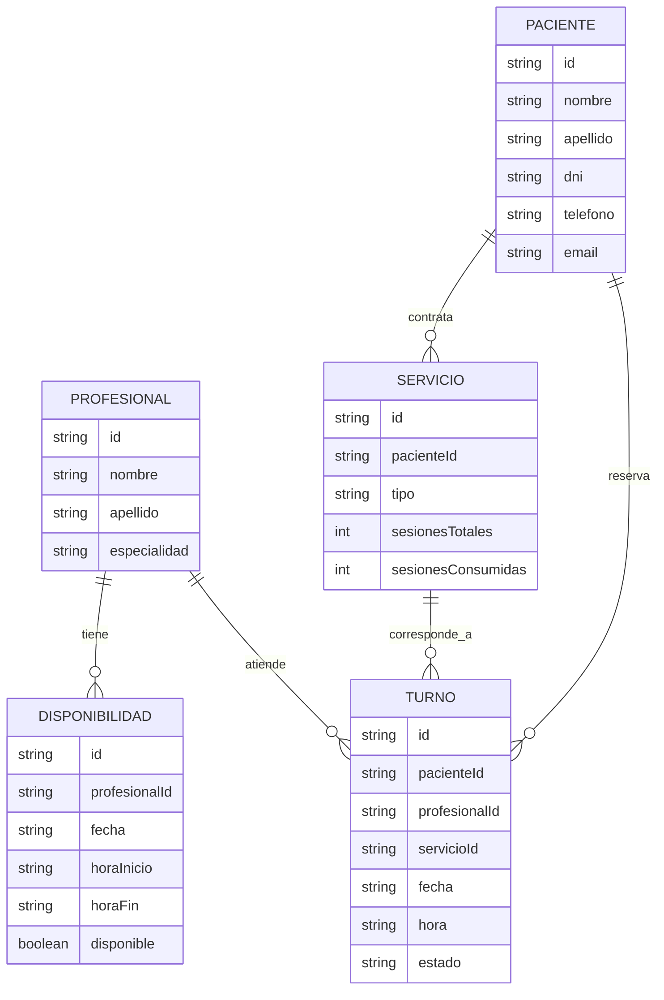

```mermaid
erDiagram
    PACIENTE ||--o{ TURNO : reserva
    PROFESIONAL ||--o{ TURNO : atiende
    PROFESIONAL ||--o{ DISPONIBILIDAD : tiene
    SERVICIO ||--o{ TURNO : corresponde_a
    PACIENTE ||--o{ SERVICIO : contrata

    PACIENTE {
        string id
        string nombre
        string apellido
        string dni
        string telefono
        string email
    }

    PROFESIONAL {
        string id
        string nombre
        string apellido
        string especialidad
    }

    DISPONIBILIDAD {
        string id
        string profesionalId
        string fecha
        string horaInicio
        string horaFin
        boolean disponible
    }

    SERVICIO {
        string id
        string pacienteId
        string tipo
        int sesionesTotales
        int sesionesConsumidas
    }

    TURNO {
        string id
        string pacienteId
        string profesionalId
        string servicioId
        string fecha
        string hora
        string estado
    }
```